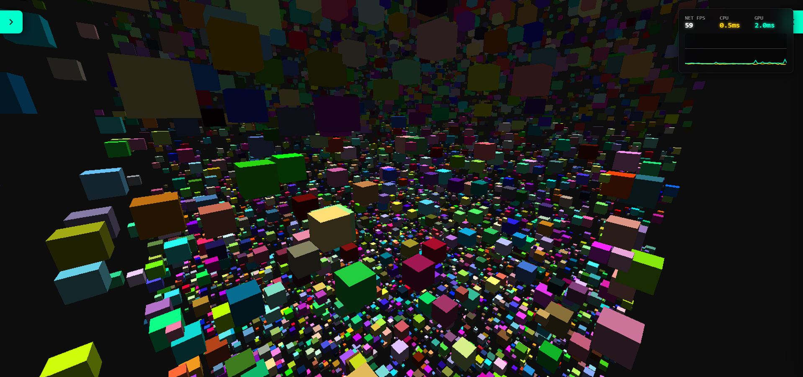
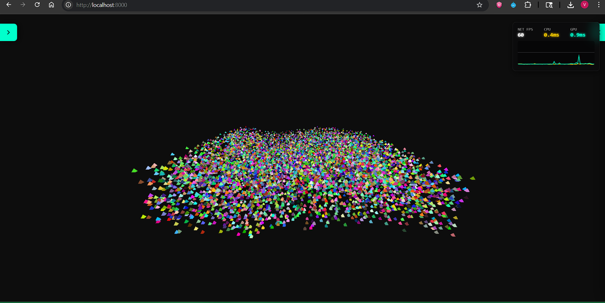
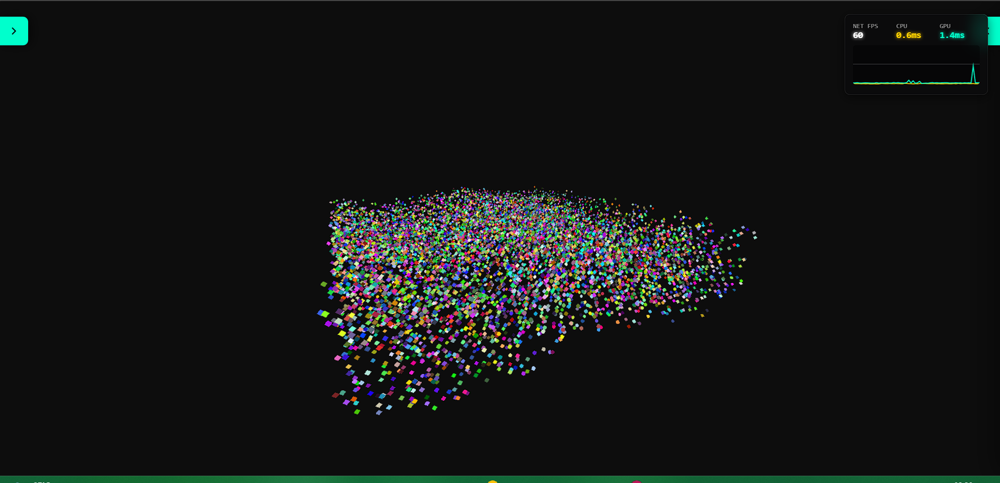
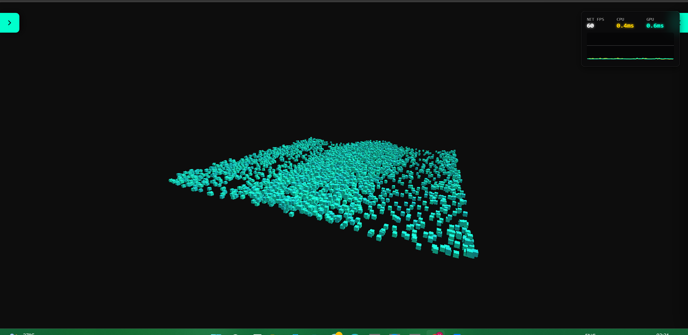
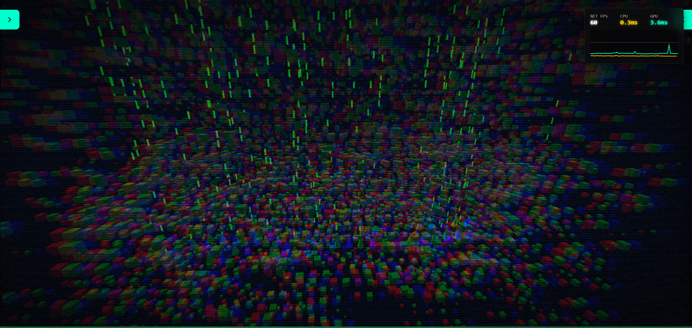
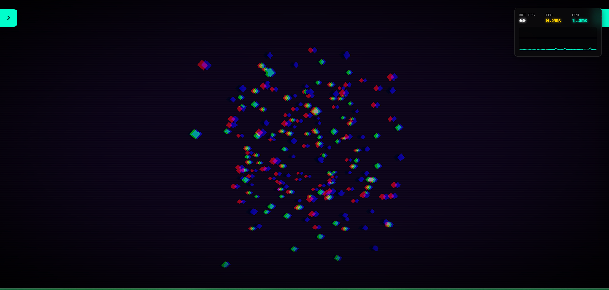
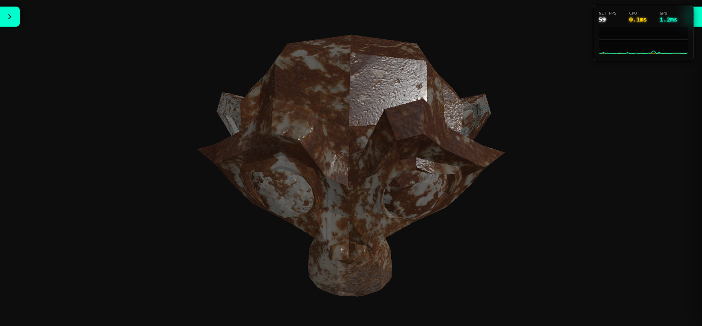
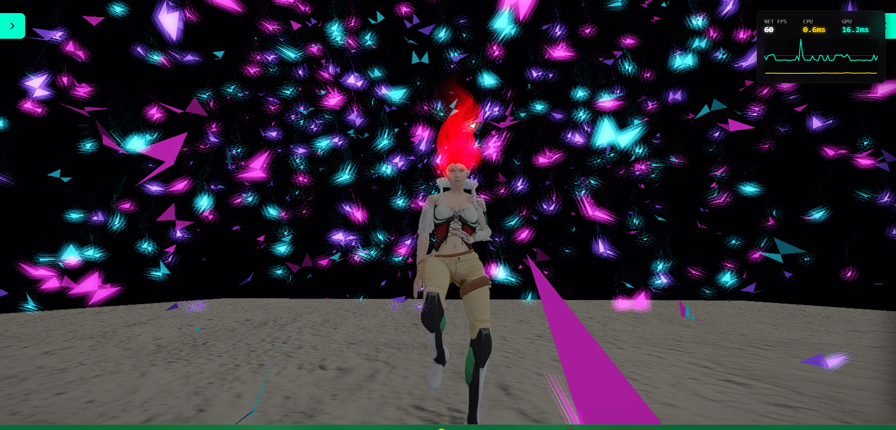
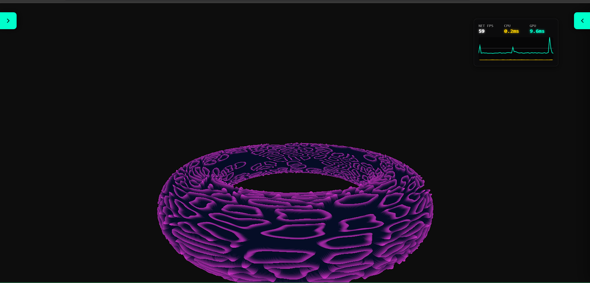

# NullGraph

> Zero scene graph. Zero copy. Infinite scale.

<div align="center">

[](https://www.npmjs.com/package/null-graph)
[](https://www.npmjs.com/package/null-graph)
[](https://bundlephobia.com/package/null-graph)
[](https://github.com/Vikas593-cloud/NullGraph-Test-Engine/blob/main/LICENSE)
[](https://github.com/Vikas593-cloud/NullGraph/stargazers)

</div>

A Data-Oriented WebGPU rendering framework for massive web worlds.

NullGraph is a brutalist, high-performance rendering library designed specifically for Web Workers and Data-Oriented Design (DOD).

It completely abandons the traditional Object-Oriented Scene Graph (`Root -> Node -> Mesh -> Geometry`) in favor of mapping raw, contiguous `ArrayBuffers` directly to WebGPU Storage Buffers.

If you are building an MMO, a voxel engine, or a multiverse with tens of thousands of dynamic entities, NullGraph ensures your main thread stays at a flat `0ms` overhead.

---


# Why NullGraph?

Traditional WebGL frameworks (like Three.js or Babylon.js) are built for ease of use, heavily relying on the `new` keyword, dynamic memory, and Garbage Collection. When scaling up to massive open worlds, this OOP overhead causes main-thread stuttering and shader compilation lag.

NullGraph solves this by doing less:

- **Zero Scene Graph:** No `.traverse()`, no `.updateMatrixWorld()`. The GPU reads your flat array directly.

- **Zero-Copy Streaming:** Calculate your ECS layout in a Web Worker, pass the `Float32Array` to the main thread, and blast it straight to VRAM.

- **Render Queues (Batches):** Render thousands of unique object types simultaneously with minimal GPU state changes.

- **No GC Spikes:** Memory is pre-allocated. No runtime object creation or destruction.

- **Compute-Driven Indirect Drawing:** Offload culling entirely to the GPU. NullGraph supports WebGPU Compute Shaders that dynamically build `IndirectDrawArgs`, resulting in zero CPU overhead for visibility checks.

- **Multi-Pass Architecture:** Seamlessly chain offscreen render passes into screen-space post-processing pipelines (Bloom, CRT, HUD effects) by attaching textures directly to subsequent batches.

---

# Installation and Setup

NullGraph is distributed as a modular ESM package. To maintain its "Zero-Copy" philosophy, it requires `gl-matrix` as a peer dependency to ensure your application and the engine share the same math structures.

## 1. Install via NPM

```bash
# Install the core engine
npm install null-graph

# Install required peer dependencies
npm install gl-matrix

# Recommended: Install WebGPU types for IDE autocomplete
npm install @webgpu/types --save-dev
```

---

## 2. Module Architecture

NullGraph uses Subpath Exports to keep your production bundles lean. You only pay for the features you import.

### `null-graph`
The Core Engine. Handles WebGPU device initialization, Pass management, and Buffer streaming.

### `null-graph/geometry`
The Math and Primitive Toolbox. Contains dynamic generators for Cubes, Spheres, and custom Vertex Layouts.

### `null-graph/loaders`
High-performance GLBParser, Animator, and SkeletonManager for hardware-accelerated skinning.

### `null-graph/materials`
StandardPBRMaterial and dynamic WGSL shader builders.

### `null-graph/debug-ui & null-graph/profiler`
Real-time performance telemetry and UI widgets.

---
# The Architecture Demo Suite

## Play the Live Demo
[null-graph.web.app](https://null-graph.web.app/)

## Github Source Code
[NullGraph-Test-Engine](https://github.com/Vikas593-cloud/NullGraph-Test-Engine)

---
#  Advanced Capabilities

## Multi-Pass Rendering & Post-Processing

NullGraph allows you to isolate rendering logic into distinct passes. You can render pristine 3D scenes offscreen and pipe them into post-processing passes.

```ts
// 1. Create an offscreen pass
const scenePass = engine.createPass({
    name: 'Offscreen Pass',
    isMainScreenPass: false,
    colorAttachments: [{
        view: offscreenTexture.createView(),
        clearValue: { r: 0.0, g: 0.01, b: 0.03, a: 1.0 },
        loadOp: 'clear', storeOp: 'store'
    }],
    // ... depth attachments
});

// 2. Create the final Post-Processing pass
const hudPass = engine.createPass({
    name: 'HUD Post Process',
    isMainScreenPass: true
});

// 3. Bind the offscreen texture to your post-process batch
const hudBatch = engine.createBatch(hudPass, { /* shader args */ });
engine.attachTextureMaterial(hudBatch, offscreenTexture.createView(), sampler);
```

## Indirect Drawing (GPU Compute Culling)

Stop relying on the CPU to figure out what to render. NullGraph batches can bind Compute Shaders to evaluate thousands of instances, write to an `IndirectDrawArgs buffer`, and command the vertex shader without the CPU ever knowing what happened.
```ts 
const batch = engine.createBatch(scenePass, {
isIndirect: true, // Tell NullGraph to use drawIndirect
computeShaderCode: `
        // Compute shader evaluates instance limits and writes to drawArgs
        let writeIdx = atomicAdd(&drawArgs.instanceCount, 1u);
        // ... cull and pack data
    `,
shaderCode: renderShaderCode,
strideFloats: 14,
maxInstances: 5000,
vertexLayouts: geometry.layout.getWebGPUDescriptor()
});
```
# Advanced Alpha Blending

Whether you need standard transparency or intense additive glowing effects, NullGraph exposes WebGPU's blend states directly at the batch level.

```ts
// Example: Additive Blending for a particle system (Quantum Nebula)
const physicsBatch = engine.createBatch(scenePass, {
    // ... shaders and layout configs
    
    // ADDITIVE BLENDING: Colors sum together, creating intense glowing cores
    blend: {
        color: { srcFactor: 'src-alpha', dstFactor: 'one', operation: 'add' },
        alpha: { srcFactor: 'one', dstFactor: 'one', operation: 'add' }
    },
    depthWriteEnabled: false,
    depthCompare: 'less'
});
```

---

# First-Class GLTF / GLB Parsing

NullGraph includes a native `GLBParser` to effortlessly ingest 3D assets. It automatically unpacks vertex layouts, indices, materials, and skeletal data into engine-ready formats.

```ts
import { GLBParser } from 'null-graph/loaders';

// Parse a GLB file directly into memory
const glbData = await GLBParser.load('./3dAssets/character.glb');

if (!glbData.meshes) throw new Error("No meshes found!");

// Easily map parsed mesh data to engine buffers
const vertexBuffer = engine.bufferManager.createVertexBuffer(glbData.meshes[0].vertices);
const indexBuffer = engine.bufferManager.createIndexBuffer(glbData.meshes[0].indices);
```

---

# Physically Based Rendering (Cook-Torrance PBR)

Achieve photorealistic lighting with NullGraph's `StandardPBRMaterial`. Built on the Cook-Torrance BRDF, it supports Albedo, Normal, and packed ARM (Ambient Occlusion, Roughness, Metallic) maps out of the box.

```ts
import { buildPBRShader, StandardPBRMaterial } from "null-graph/materials";

// 1. Generate a dynamic shader optimized for your mesh needs
const dynamicShaderCode = buildPBRShader({ useSkinning: true });

const meshBatch = engine.createBatch(mainPass, {
    shaderCode: dynamicShaderCode,
    // ... layout configs
});

// 2. Create the PBR Material with loaded textures
const pbrMaterial = new StandardPBRMaterial(engine, {
    albedoMap: albedoView,
    normalMap: normalView,
    packedMap: armView,         // AO, Roughness, Metallic
    packedMapFormat: "ARM",
    baseColor: [1.0, 1.0, 1.0, 1.0],
    metallicMultiplier: 1.0,
    roughnessMultiplier: 1.0
});

// 3. Apply it to your batch
pbrMaterial.applyToBatch(meshBatch);
```

---

# Hardware-Accelerated Skeletal Animations

NullGraph splits the heavy lifting: the CPU evaluates the animation timeline, and the GPU handles the vertex skinning. The `SkeletonManager` bridges the gap, allowing you to animate complex characters efficiently.

```ts
import { Animator, SkeletonManager } from 'null-graph/loaders';

// 1. Initialize animation systems with parsed GLB data
const skeletonManager = new SkeletonManager(engine.device, 70); // Max bones
const animator = new Animator(glbData.skin);
animator.play(glbData.animations[0]);

// 2. Bind the skeleton buffer to your mesh batch (Group 2)
engine.attachCustomBindGroup(
    meshBatch,
    [{ binding: 0, resource: { buffer: skeletonManager.boneBuffer } }],
    2
);

// 3. Update loop
export function update(deltaTime: number) {
    // CPU computes the bone transforms ONCE
    animator.update(deltaTime);
    
    // GPU gets the updated bone matrices ONCE
    skeletonManager.updateFromAnimator(engine.device, animator);
}
```
# Quick Start (Hello, Cube!)

NullGraph uses a heavily optimized Render Batch architecture. To get your first object on screen, we'll create a default pass, generate a primitive cube, apply a PBR material using the engine's fallback textures, and blast it to the GPU.

```ts
import { NullGraph, Camera } from 'null-graph';
import { Primitives, StandardLayout } from 'null-graph/geometry';
import { buildPBRShader, StandardPBRMaterial } from 'null-graph/materials';

async function main() {
    try {
        const canvas = document.getElementById('gpuCanvas');

        canvas.width = window.innerWidth;
        canvas.height = window.innerHeight;

        console.log("1. Initializing NullGraph...");
        const engine = new NullGraph();
        await engine.init(canvas);

        console.log("2. Setting up Camera...");
        const camera = new Camera(75, canvas.width / canvas.height, 0.1, 1000.0);

        console.log("3. Creating Pass and Geometry...");
        const mainPass = engine.createPass({ name: 'Main', isMainScreenPass: true });

        const cubeGeom = Primitives.createCube(StandardLayout, 2, 2, 2);
        cubeGeom.upload(engine);

        console.log("4. Creating Material and Batch...");
        const material = new StandardPBRMaterial(engine, {
            albedoMap: engine.textureManager.fallbackWhite,
            normalMap: engine.textureManager.fallbackNormal,
            packedMap: engine.textureManager.fallbackWhite,
            packedMapFormat: "ARM",
            baseColor: [0.1, 0.5, 0.9, 1.0], // Blue
            metallicMultiplier: 0.2,
            roughnessMultiplier: 0.5
        });

        const cubeBatch = engine.createBatch(mainPass, {
            shaderCode: buildPBRShader({ useSkinning: false }),
            strideFloats: 14,
            maxInstances: 1,
            vertexLayouts: cubeGeom.layout.getWebGPUDescriptor(),
            depthWriteEnabled: true
        });

        material.applyToBatch(cubeBatch);
        engine.setBatchGeometry(cubeBatch, cubeGeom.vertexBuffer, cubeGeom.indexBuffer, cubeGeom.indices.length);

        console.log("5. Setting Instance Data...");
        const initialData = new Float32Array(14);
        initialData[1] = 0.0; initialData[2] = 0.0; initialData[3] = 0.0; // Position XYZ
        initialData[7] = 1.0; // Rotation W
        initialData[8] = 1.0; initialData[9] = 1.0; initialData[10] = 1.0; // Scale XYZ
        initialData[11] = 1.0; initialData[12] = 1.0; initialData[13] = 1.0; // Color RGB

        engine.updateBatchData(cubeBatch, initialData, 1);

        console.log("6. Starting Render Loop...");
        function frame() {
            const simTime = performance.now() * 0.001;

            // Orbit the camera around the cube
            camera.updateView(
                [Math.sin(simTime) * 8, 3, Math.cos(simTime) * 8], // Eye
                [0, 0, 0] // Look Target
            );
            engine.updateCamera(camera);

            engine.render();
            requestAnimationFrame(frame);
        }

        frame();

    } catch (err) {
        console.error("CRITICAL ENGINE ERROR:", err);
    }
}

main();
```
## Roadmap

NullGraph is the high-performance rendering backbone for the Axion Engine.

---

### Core Architecture

- [x] Multi-Object Render Queue / Batching

- [x] Depth / Z-Buffer Integration (Proper 3D occlusion)

- [x] VBO/IBO Geometry Buffer Manager

- [x] Multi-Pass Rendering & Texture Attachments

- [x] GPU Compute Frustum Culling & Indirect Drawing

- [x] Geometry Builder & `null-graph/geometry` extras

---

### Materials & Assets

- [x] Physically Based Rendering (Cook-Torrance BRDF)

- [x] Integrated PBR Material System (Albedo, Normal, ARM maps)

- [x] Native GLB/GLTF Parsing & Resource Unpacking

- [x] Alpha Blending & Additive Transparency States

---

### Animation & Logic

- [x] Hardware-Accelerated Skeletal Animation (GPU Skinning)

- [x] Animation Timeline & Keyframe Interpolation (Animator)

- [ ] Morph Targets / Shape Keys

- [ ] GPU-Driven Particle Systems (Compute-based)

---

### Lighting & Post-Processing

- [ ] Directional Shadows / Cascaded Shadow Maps (CSM)

- [ ] Image-Based Lighting (IBL) & Environment Mapping

- [ ] Post-Processing Pipeline (Bloom, Chromatic Aberration, SSAO)

- [ ] Real-time Point Light Culling (Forward+ Rendering)
---

# Tech Stack: The Lean Machine

NullGraph is built with a "Zero-Bloat" philosophy. We rely on the bare essentials to stay close to the metal and ensure maximum execution speed.

- **Language:** TypeScript / JavaScript (Strictly typed for engine safety).

- **API:** Native WebGPU (No WebGL legacy overhead).

- **Math:** `gl-matrix` (High-performance vector and matrix operations).

- **Dependencies:** `0` (We don't believe in heavy framework dependencies).
### License
NullGraph is released under the MIT License.

---

## Showcase

<div align="center">

### Architecture Demos
|                         AoS                         |                         SoA                         |                         AoSoA                         |
|:---------------------------------------------------:|:---------------------------------------------------:|:-----------------------------------------------------:|
|  |  |  |

### GPU Compute & Post-Processing
|                        GPU Culling                         |                        Space Fleet                         | CRT Effect |
|:----------------------------------------------------------:|:----------------------------------------------------------:|:----------:|
|  |  |

### PBR Materials & Animation
|                         Rusty Metal                         |                            Skeletal Animation                             |                         Morphogenesis                         |
|:-----------------------------------------------------------:|:-------------------------------------------------------------------------:|:-------------------------------------------------------------:|
|  |  |  |

</div>

---

## 📦 Package Stats

<div align="center">

| Metric | Value |
|--------|-------|
| **Weekly Downloads** |  |
| **Version** |  |
| **License** |  |
| **Minified + GZip** |  |

</div>

---

## 🔗 Related Repositories

| Repository                                                                           | Description |
|--------------------------------------------------------------------------------------|-------------|
| [**NullGraph Test Engine**](https://github.com/Vikas593-cloud/NullGraph-Test-Engine) | Interactive demo suite & documentation hub |
| [**Axion Engine**](https://axion-engine.web.app)                                     | Full game engine built on NullGraph |

<p align="center">
  <sub>Built with 🔥 by the NullGraph</sub>
</p>